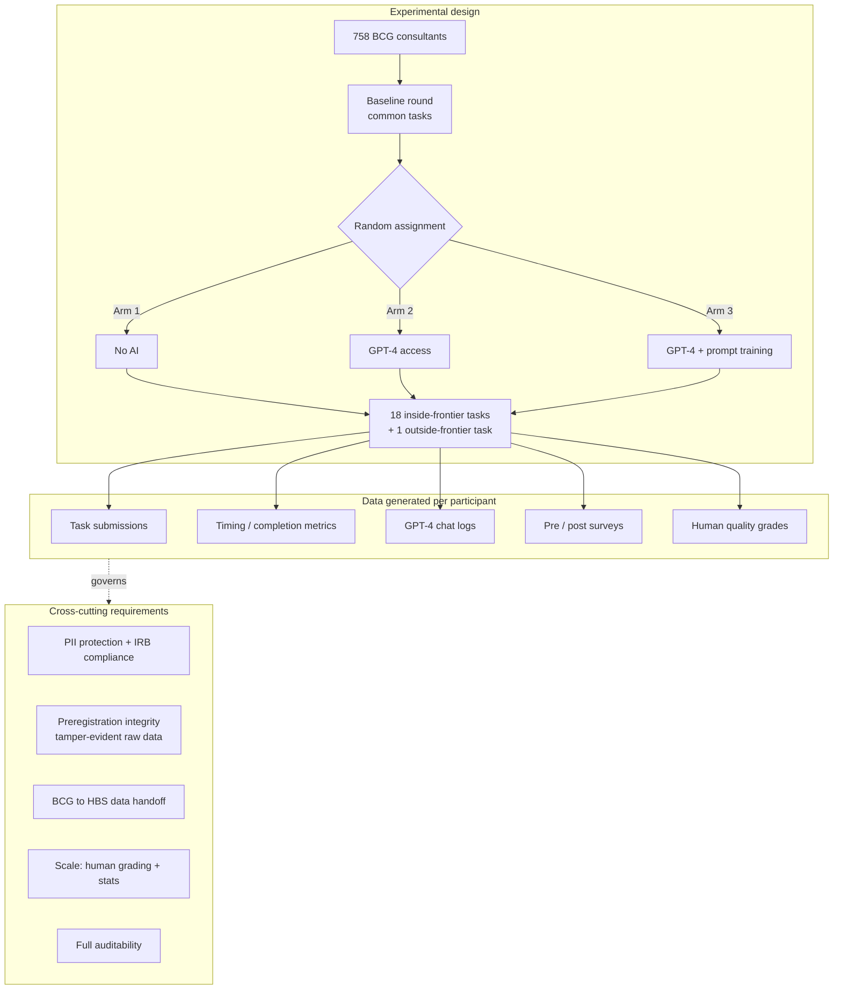
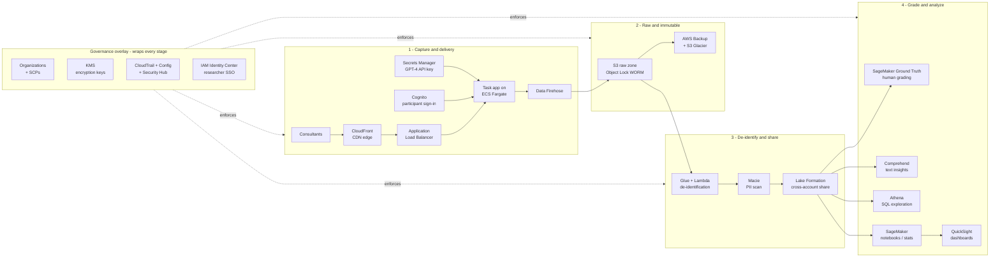

# Case Study 1 — Architecting the "Jagged Technological Frontier" Experiment on AWS

> **The challenge in one sentence:** take a preregistered, multi-organization,
> human-subjects experiment with 758 elite consultants — full of personally
> identifiable information (PII), proprietary tasks, and AI chat logs — and host
> it on AWS so the data is captured at scale, locked down tight, handed cleanly
> from one company to a university, graded by humans, analyzed by statisticians,
> and auditable end to end.

**The paper.** Dell'Acqua, McFowland III, Mollick, Lifshitz, Kellogg, Rajendran,
Krayer, Candelon & Lakhani (2026), *Navigating the Jagged Technological Frontier:
Field Experimental Evidence of the Effects of Artificial Intelligence on
Knowledge Worker Productivity and Quality*, **Organization Science** —
[doi.org/10.1287/orsc.2025.21838](https://doi.org/10.1287/orsc.2025.21838).
Funded by the Harvard Business School (HBS) Digital Data Design Institute.

> **Why this case for an HBS data architect?** It is the archetype of the work
> HBS supports for its researchers: a randomized controlled trial (RCT) run *with*
> an outside firm, generating sensitive data that must reach a small author team
> safely and survive scrutiny for years. Solve this one and you have a blueprint
> for hundreds of faculty studies.

---

## 1. The study at a glance

A preregistered RCT, run in collaboration with the global management consulting
firm **Boston Consulting Group (BCG)**, measured how the **Generative Pre-trained
Transformer 4 (GPT-4)** — a **large language model (LLM)** — affects knowledge
work. The design:

- **758 consultants** first completed a **baseline** round on common tasks.
- Each was then **randomly assigned** to one of three arms: *no AI*, *GPT-4
  access*, or *GPT-4 access plus a prompt-engineering overview*.
- Everyone tackled **18 "inside-the-frontier" tasks** (creative → analytical)
  plus **one deliberately "outside-the-frontier" task**.
- BCG **collected** the data; the HBS-led author team **received and analyzed**
  it.

Result: inside the frontier, AI users finished **12.2% more tasks, 25.1% faster,
at higher quality**; outside it, AI users were **19% less likely** to be correct —
the "jagged frontier."

### Diagram A — what the research *requires*

---

## 2. Reading the requirements like an architect

Every research need becomes an architectural constraint:

| Research requirement | What it really demands | Architectural pressure |
|---|---|---|
| 758 participants, 3 arms, timed | Reliable web delivery + accurate event capture | Scalable, low-latency front end; durable event stream |
| GPT-4 in two of three arms | Secure use of a third-party API (Application Programming Interface) | Secret management; logged interactions |
| Employee PII + proprietary tasks | Encrypt everything; minimize who sees raw data | De-identification + fine-grained access |
| Preregistered RCT | "As-collected" data must be immutable | Write Once Read Many (WORM) storage |
| BCG collects, HBS analyzes | Safe cross-organization handoff | Cross-account sharing without copying secrets around |
| Human-graded quality | Manage many graders, consensus, audit trail | A managed labeling workflow |
| Defensible for years | Prove who touched what, retain long-term | Central audit logging + archival |

---

## 3. The AWS solution

The architecture follows the data's life: **capture → lock → protect → work →
govern.** Acronyms are expanded on first use; each service links to its product
page.

### Diagram B — the AWS reference architecture

### Stage 1 — Capture & delivery

Consultants reach the task platform through [Amazon CloudFront](https://aws.amazon.com/cloudfront/),
AWS's **content delivery network (CDN)**, which terminates Transport Layer
Security and serves the app from an edge location near each user. Traffic passes
an [Application Load Balancer (ALB)](https://aws.amazon.com/elasticloadbalancing/)
into the task application running as containers on
[AWS Fargate](https://aws.amazon.com/fargate/) — the serverless engine for
[Amazon ECS (Elastic Container Service)](https://aws.amazon.com/ecs/) — so
capacity scales to the cohort with no servers to manage.
[Amazon Cognito](https://aws.amazon.com/cognito/) authenticates each participant
and binds their session to an experimental arm. The GPT-4 **API** key is held in
[AWS Secrets Manager](https://aws.amazon.com/secrets-manager/) and injected at
runtime — never hard-coded. Every interaction event (submission, keystroke
timing, and the full GPT-4 chat transcript) is streamed by
[Amazon Data Firehose](https://aws.amazon.com/firehose/) straight into the data
lake, batched and converted to columnar Parquet on the way in.

### Stage 2 — Raw & immutable

Firehose lands events in an [Amazon S3 (Simple Storage Service)](https://aws.amazon.com/s3/)
"raw" zone with **S3 Object Lock** enabled — **WORM** storage that makes the
as-collected dataset tamper-evident, exactly what a preregistered study needs to
prove nothing was altered after the fact. [AWS Backup](https://aws.amazon.com/backup/)
and lifecycle transitions to [Amazon S3 Glacier](https://aws.amazon.com/s3/storage-classes/glacier/)
keep cheap, durable long-term copies for the multi-year retention research
demands.

### Stage 3 — De-identify & share (the BCG → HBS handoff)

Before any researcher sees a row, an [AWS Glue](https://aws.amazon.com/glue/)
**extract-transform-load (ETL)** job plus [AWS Lambda](https://aws.amazon.com/lambda/)
functions tokenize consultant identifiers and strip direct identifiers.
[Amazon Macie](https://aws.amazon.com/macie/) then scans the buckets with machine
learning to confirm no residual **PII** slipped through.
[AWS Lake Formation](https://aws.amazon.com/lake-formation/) governs a
cross-account share so BCG's collection account exposes only the cleaned tables to
HBS's analysis account — with column-level masking on anything sensitive. If BCG
preferred to never hand over raw records at all,
[AWS Clean Rooms](https://aws.amazon.com/clean-rooms/) would let the two parties
run joint analysis on a privacy-protected dataset instead.

### Stage 4 — Grade & analyze

Human evaluators score submission quality through
[Amazon SageMaker Ground Truth](https://aws.amazon.com/sagemaker/groundtruth/),
a managed labeling service that handles multiple graders, consensus, and an audit
trail — vastly better than a homemade grading sheet.
[Amazon Comprehend](https://aws.amazon.com/comprehend/), a natural-language
processing service, mines the open-text answers and GPT-4 logs for sentiment and
themes. Analysts explore with [Amazon Athena](https://aws.amazon.com/athena/) —
serverless **Structured Query Language (SQL)** over the S3 lake — run the
preregistered regressions in [Amazon SageMaker](https://aws.amazon.com/sagemaker/)
notebooks (reaching for [Amazon EMR](https://aws.amazon.com/emr/) if a step needs
heavy Apache Spark compute), and visualize effects by arm and task in
[Amazon QuickSight](https://aws.amazon.com/quicksight/).

### The governance overlay (every stage)

[AWS Organizations](https://aws.amazon.com/organizations/) with **Service Control
Policies (SCPs)** sets organization-wide guardrails — pin resources to an approved
Region for data residency, forbid disabling logging, mandate encryption — that
bind even an account administrator (see the *AWS Organizations & SCPs* topic in
the study guide). [AWS Key Management Service (KMS)](https://aws.amazon.com/kms/)
encrypts every bucket and volume. [AWS CloudTrail](https://aws.amazon.com/cloudtrail/),
[AWS Config](https://aws.amazon.com/config/), and
[AWS Security Hub](https://aws.amazon.com/security-hub/) record who did what and
flag drift — the audit trail an **Institutional Review Board (IRB)** expects.
[AWS IAM Identity Center](https://aws.amazon.com/iam/identity-center/) gives the
research team **single sign-on (SSO)**, so onboarding and offboarding analysts is
one action, not many.

---

## 4. Requirement → service cheat sheet

| Requirement | Primary AWS service(s) |
|---|---|
| Scalable task delivery | CloudFront → ALB → ECS/Fargate |
| Participant identity per arm | Cognito |
| Secure GPT-4 API key | Secrets Manager |
| High-volume event capture | Data Firehose → S3 |
| Tamper-evident raw data | S3 Object Lock (WORM) |
| Long-term retention | S3 Glacier + AWS Backup |
| De-identification | Glue + Lambda |
| PII verification | Macie |
| Cross-org data share | Lake Formation (or Clean Rooms) |
| Human grading at scale | SageMaker Ground Truth |
| Text analytics | Comprehend |
| Exploration & stats | Athena, SageMaker, EMR |
| Reporting | QuickSight |
| Org-wide guardrails | Organizations + SCPs |
| Encryption | KMS |
| Audit & compliance | CloudTrail, Config, Security Hub |
| Researcher access | IAM Identity Center |

---

## 5. Exam tie-ins (SAA-C03)

- **S3 Object Lock = WORM** → the go-to answer whenever a question says
  "immutable," "tamper-proof," "regulatory retention," or "cannot be deleted."
- **Macie** → "discover and classify **PII / sensitive data in S3**." Don't
  confuse with GuardDuty (threat detection) or Inspector (vulnerability scanning).
- **Lake Formation vs raw S3/IAM policies** → choose Lake Formation for
  **fine-grained, cross-account** governance over a lake.
- **SCPs** → preventive guardrail that caps permissions org-wide; never grants
  access, and never restricts the management account.
- **Data Firehose vs Kinesis Data Streams** → Firehose = managed **load to a
  destination** (no replay); Streams = custom real-time with replay.
- **Fargate** → "containers **without managing servers**."

---

## 6. Resources

- [Navigating the Jagged Technological Frontier (Organization Science, 2026)](https://doi.org/10.1287/orsc.2025.21838)
- [Well-Architected Framework — security & data protection](https://aws.amazon.com/architecture/well-architected/)
- [Amazon S3 Object Lock](https://docs.aws.amazon.com/AmazonS3/latest/userguide/object-lock.html)
- [Amazon Macie](https://aws.amazon.com/macie/) · [AWS Lake Formation](https://aws.amazon.com/lake-formation/) · [AWS Clean Rooms](https://aws.amazon.com/clean-rooms/)
- [SageMaker Ground Truth](https://aws.amazon.com/sagemaker/groundtruth/)
- [AWS Organizations — SCPs](https://docs.aws.amazon.com/organizations/latest/userguide/orgs_manage_policies_scps.html)
