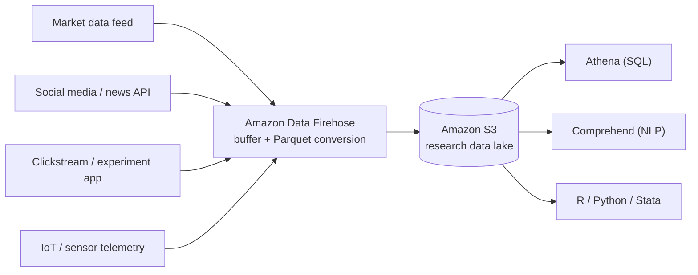
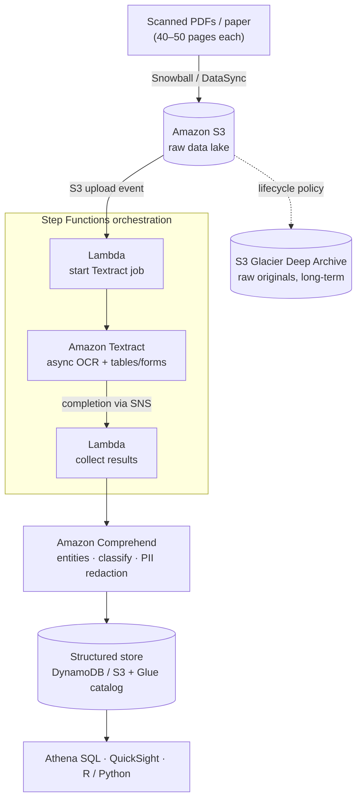

# AWS SAA-C03 Study Guide — Companion Notes

Deeper-dive notes that go **beyond** the Anki deck. The deck is for fast recall
of *what a service is* and *when to pick it*; this guide is for the "I need to
actually understand this" moments — concepts, trade-offs, and how a topic shows
up in real architecture decisions.

## How to use this guide

- Each topic follows the same template (see below) so it stays scannable.
- Two scenario types accompany each topic: a **greenfield design** decision and
  a **lift-and-shift / migration** decision, since the exam frames questions
  both ways.
- Add new topics under [[#Topics|Topics]] and link them in the table of contents.

### Topic template

```markdown
### <Topic name>

**Concept** — plain-language explanation.
**Why it matters** — the practical payoff.
**Exam angle** — the distinctions/"don't confuse with" the exam tests.

**Scenario — design:** <new-build situation and the right call>
**Scenario — lift & shift:** <migration situation and the right call>

**Resources:** links.
```

## Table of contents

- [[#Networking & Content Delivery|Networking & Content Delivery]]
  - [[#Anycast IPs & AWS Global Accelerator|Anycast IPs & AWS Global Accelerator]]
  - [[#BGP — Border Gateway Protocol|BGP — Border Gateway Protocol]]
  - [[#AWS Cloud Map|AWS Cloud Map]]
  - [[#AWS Transit Gateway|AWS Transit Gateway]]
  - [[#AWS App Mesh|AWS App Mesh]]
- [[#Analytics|Analytics]]
  - [[#Amazon Data Firehose|Amazon Data Firehose]]
  - [[#AWS Lake Formation|AWS Lake Formation]]
- [[#Management & Governance|Management & Governance]]
  - [[#AWS Organizations & Service Control Policies (SCPs)|AWS Organizations & Service Control Policies (SCPs)]]
  - [[#AWS Control Tower|AWS Control Tower]]
- [[#Developer Tools|Developer Tools]]
  - [[#AWS X-Ray|AWS X-Ray]]
- [[#Machine Learning & AI|Machine Learning & AI]]
  - [[#Amazon Textract|Amazon Textract]]
  - [[#Amazon Comprehend|Amazon Comprehend]]
- [[#Security, Identity & Compliance|Security, Identity & Compliance]]
  - [[#AWS Security Hub|AWS Security Hub]]
  - [[#AWS CloudHSM|AWS CloudHSM]]
- [[#Storage|Storage]]
  - [[#Amazon EFS — Elastic File System|Amazon EFS — Elastic File System]]
- [[#Applied Solutions|Applied Solutions]]
  - [[#HBS case study — digitizing decades of bankruptcy filings|HBS case study — digitizing decades of bankruptcy filings]]

---

## Topics

## Networking & Content Delivery

### Anycast IPs & AWS Global Accelerator

**Concept** — *Anycast* is an addressing method where the **same IP (Internet Protocol) address is
advertised from many locations at once**, and internet routing via BGP (Border
Gateway Protocol) delivers
each user to the *nearest* one. Contrast with **unicast** (the normal case),
where one IP maps to one server in one place: a user in Tokyo hitting a unicast
IP in Virginia sends packets all the way to Virginia. With anycast, that same IP
is announced from Tokyo, Frankfurt, and Virginia simultaneously, and each user's
traffic enters at whichever site is closest in network terms — same destination
IP, different physical endpoint.

**Why it matters**

- **Lower latency** — traffic enters the provider's backbone at the nearest
  point of presence instead of crossing the public internet to a distant region.
- **Availability & failover** — if one location goes down, BGP simply routes to
  the next-nearest one.
- **DDoS (Distributed Denial of Service) resilience** — an attack is spread across many sites rather than
  concentrated on a single server.
- **Stable entry point** — you get a fixed IP that "follows" the user
  geographically.

**AWS Global Accelerator** (GA) is AWS's anycast offering: it gives you **two static
anycast IP addresses** that act as a fixed front door. Users connect to the
nearest AWS edge location via those IPs, then traffic rides the **AWS backbone**
to your application in whichever Region is healthiest — with fast, sub-minute
failover.

**Exam angle — don't confuse with:**

- **vs CloudFront** — CloudFront *caches* HTTP/HTTPS (Hypertext Transfer
  Protocol / Secure) content at the edge. Global Accelerator does **not** cache;
  it just gets any **TCP/UDP** (Transmission Control Protocol / User Datagram
  Protocol) traffic onto the AWS network fast and fails over quickly. Reach for
  GA for non-HTTP protocols, gaming, IoT (Internet of Things), VoIP (Voice over
  IP), or when you need static IPs; reach for CloudFront for
  cacheable web content.
- **vs Route 53 latency/geo routing** — Route 53 steers users by handing back
  *different IPs* in DNS (Domain Name System) responses (subject to DNS
  caching/TTL, Time To Live). GA steers users
  with a *single shared anycast IP*, so failover isn't gated on DNS propagation.
- **vs Standard unicast + DNS** — DNS-based steering gives different users
  different addresses; anycast achieves steering with one address.

**Scenario — design:** You're building a real-time multiplayer game backend on
NLBs (Network Load Balancers) in `us-east-1` and `ap-northeast-1`. Players worldwide need the lowest
possible latency over UDP and a single stable endpoint to hard-code in the
client. → **Global Accelerator**: two static anycast IPs, edge ingress onto the
AWS backbone, automatic routing to the nearest healthy Region. CloudFront
wouldn't fit (non-cacheable UDP), and Route 53 alone leaves you exposed to DNS
TTL during failover.

**Scenario — lift & shift:** You migrate a legacy on-prem application whose
clients have a firewall allowlist of **specific IP addresses** baked in and
can't be easily changed. You still want multi-Region resilience after the move.
→ **Global Accelerator** gives you two fixed anycast IPs to put on the allowlist
once, while you remain free to change, scale, or fail over the backend Regions
behind them without ever touching the client config.

**Resources:**

- [Global Accelerator — product page](https://aws.amazon.com/global-accelerator/)
- [Global Accelerator — Developer Guide: What is AGA?](https://docs.aws.amazon.com/global-accelerator/latest/dg/what-is-global-accelerator.html)
- [Global Accelerator vs CloudFront (FAQ)](https://aws.amazon.com/global-accelerator/faqs/)
- [CloudFront — product page](https://aws.amazon.com/cloudfront/)
- [Route 53 routing policies](https://docs.aws.amazon.com/Route53/latest/DeveloperGuide/routing-policy.html)

### BGP — Border Gateway Protocol

**Concept** — BGP is the routing protocol that runs the internet — think of it
as the internet's postal service, choosing how data gets from one network to
another. The internet isn't one network but thousands of independently operated
ones called **Autonomous Systems (AS)**, owned by Internet Service Providers
(ISPs), large enterprises, and cloud providers. BGP is how those systems
advertise to each other which IP address ranges they can reach, so a packet can
hop network-to-network all the way to its destination. Crucially, it selects
paths by configured **policy** (peering and business rules), not simply the
shortest physical distance. It does three things:

- **Path selection** — evaluates available routes and picks the best per policy.
- **Route advertisement** — routers announce the IP ranges they can reach.
- **Policy control** — operators prioritize, avoid, or balance routes.

Two flavors: **eBGP (external BGP)** exchanges routes *between* different
Autonomous Systems (e.g., your ISP to a neighboring ISP); **iBGP (internal
BGP)** shares routes *within* a single AS.

**Why it matters** — BGP is what makes dynamic, resilient routing possible: it
supports **multihoming** (connecting to multiple ISPs for redundancy) and
automatically updates routing tables when a link fails. The flip side is that a
misconfigured BGP advertisement can trigger large-scale internet outages. In
AWS, BGP is the mechanism behind anycast (Global Accelerator) and behind dynamic
routing on hybrid connectivity.

**Exam angle — where BGP shows up:**

- **Direct Connect and Site-to-Site VPN use BGP** for *dynamic* routing — routes
  are exchanged and failover happens automatically. Contrast with **static
  routing** on a VPN, where you hand-configure routes and there's no automatic
  reconvergence.
- **vs static routes** — BGP adapts when a path dies; static routes don't.
- **Underpins anycast / Global Accelerator** — the "route to the nearest healthy
  location" behavior of anycast is BGP doing path selection (see
  [[#Anycast IPs & AWS Global Accelerator|Anycast IPs & AWS Global Accelerator]]).

**Scenario — design:** You're building hybrid connectivity with a primary
**Direct Connect** link and a **Site-to-Site VPN** as backup, and you want
traffic to fail over automatically if Direct Connect drops. → Run **BGP** on
both connections and advertise the same prefixes with path preferences; BGP
reroutes to the VPN on failure with no manual route changes.

**Scenario — lift & shift:** You migrate an on-prem network that already
**multihomes across two ISPs** using BGP and its own AS number. Connecting to
AWS over Direct Connect, you keep using BGP to exchange routes dynamically,
preserving the redundancy model you already operate.

**Resources:**

- [AWS — What is BGP?](https://aws.amazon.com/what-is/border-gateway-protocol/)
- [Cloudflare — What is BGP?](https://www.cloudflare.com/learning/security/glossary/what-is-bgp/)
- [Direct Connect — routing policies and BGP communities](https://docs.aws.amazon.com/directconnect/latest/UserGuide/routing-and-bgp.html)
- [Site-to-Site VPN — routing options (static vs BGP)](https://docs.aws.amazon.com/vpn/latest/s2svpn/VPNRoutingTypes.html)

### AWS Cloud Map

**Concept** — Cloud Map is a **service-discovery registry** for your
application's resources. You register components — microservices, databases,
queues, or any resource — under friendly logical names, and your application
**resolves them by name to get their current location** as they change
dynamically (scaling events, redeploys, failovers). It supports two discovery
methods: **DNS-based** (Cloud Map creates and manages the Route 53 records for
you) and **API-based** (Application Programming Interface) via the
`DiscoverInstances` call, which can return **health-aware** results and works
for **non-IP resources** (e.g., a queue URL or table name) with custom
attributes attached.

**Why it matters** — In dynamic microservice architectures, endpoints change
constantly, so hardcoding IPs or URLs breaks. Cloud Map is the single
source of truth for "what's running where, right now," letting services find
each other by logical name and automatically filtering out unhealthy instances.
**ECS Service Discovery is built on Cloud Map** — registering and deregistering
tasks for you as they start and stop.

**Exam angle — don't confuse with:**

- **vs Route 53** — the key distinction. Route 53 is **DNS**: it resolves names
  to IPs for internet/VPC (Virtual Private Cloud) routing. Cloud Map is an **application-level service
  registry** — it can track **non-IP** resources and arbitrary attributes, is
  queryable via API with health filtering, and uses Route 53 under the hood only
  for its DNS-based mode. Keyword cues: *"service discovery for microservices /
  register resources and resolve by name / dynamic endpoints"* → Cloud Map;
  *"domain names / hosted zones / DNS routing policies"* → Route 53.
- **vs App Mesh** — App Mesh is the **service mesh** (traffic routing,
  retries, observability via Envoy proxies); Cloud Map is the **discovery**
  layer it can pull endpoints from. Mesh = how traffic flows; Cloud Map = where
  things are.
- **vs ELB** — a load balancer *distributes* traffic across registered targets;
  Cloud Map *names and discovers* resources. They solve different problems.

**Scenario — design:** You're building microservices on **ECS** that scale up
and down continuously and need to call each other without hardcoded addresses.
→ Enable **ECS Service Discovery** (backed by **Cloud Map**): each service
registers under a name, callers resolve the current healthy endpoints by name,
and deregistration is automatic as tasks cycle.

**Scenario — lift & shift:** You migrate an app that relied on a self-managed
service registry (e.g., Consul or Eureka) or hardcoded host lists. → Register
the components in **Cloud Map** and resolve them by name via DNS or the
`DiscoverInstances` API, retiring the self-operated registry while keeping the
discover-by-name pattern the app already expects.

**Resources:**

- [AWS Cloud Map — product page](https://aws.amazon.com/cloud-map/)
- [What is AWS Cloud Map? (Developer Guide)](https://docs.aws.amazon.com/cloud-map/latest/dg/what-is-cloud-map.html)
- [ECS service discovery with Cloud Map](https://docs.aws.amazon.com/AmazonECS/latest/developerguide/service-discovery.html)

### AWS Transit Gateway

**Concept** — Transit Gateway (TGW) is a **regional network hub** that connects
many VPCs and on-premises networks (via Site-to-Site VPN or Direct Connect)
through a **single gateway** — a hub-and-spoke model that replaces a tangle of
point-to-point VPC peering connections. Each network *attaches* to the TGW, and
**routing is transitive**: spokes can reach each other through the hub, governed
by TGW route tables you control. It scales to thousands of VPCs, and you can
**peer TGWs across Regions** for global connectivity or share one across
accounts with Resource Access Manager (RAM).

**Why it matters** — VPC peering is **1:1 and non-transitive**: A↔B and B↔C does
*not* give A↔C, so connecting *n* VPCs into a full mesh needs ~n²/2 peering links
to manage. As the environment grows that becomes unmanageable, and peering can't
centralize on-prem connectivity. TGW collapses all of that into one hub with
central route tables — far simpler to operate, segment, and extend to the data
center.

**Exam angle — don't confuse with:**

- **vs VPC Peering** — the key pairing. Peering is **one-to-one,
  non-transitive**, with no central routing — fine for a couple of VPCs. TGW is
  the **scalable, transitive hub** for many VPCs plus on-prem. Keyword cues:
  *"many VPCs / hub-and-spoke / transitive routing / connect on-prem at scale"*
  → Transit Gateway; *"simple connection between two VPCs"* → VPC Peering.
- **vs VPN / Direct Connect** — these are *how you reach on-prem*; TGW is the
  *hub you attach them to*. They're complementary, not alternatives.
- **vs VPC** — the VPC is the network itself; TGW is what **connects many VPCs
  together**.

**Scenario — design:** A company is standing up dozens of VPCs (per team and
environment) that must communicate with each other and with the corporate data
center. → **Transit Gateway**: attach every VPC plus a Direct Connect gateway to
one hub, and control inter-VPC reachability with TGW route tables — no peering
mesh to maintain.

**Scenario — lift & shift:** You migrate a multi-site on-prem network with
several data centers into AWS and need consolidated hybrid routing. → Terminate
**Site-to-Site VPN** / **Direct Connect** on a **Transit Gateway** alongside the
migrated VPCs for one central routing domain, and use cross-Region TGW peering if
you need global reach.

**Resources:**

- [AWS Transit Gateway — product page](https://aws.amazon.com/transit-gateway/)
- [What is a transit gateway? (User Guide)](https://docs.aws.amazon.com/vpc/latest/tgw/what-is-transit-gateway.html)
- [Transit Gateway vs VPC peering design considerations](https://docs.aws.amazon.com/whitepapers/latest/building-scalable-secure-multi-vpc-network-infrastructure/transit-gateway.html)

### AWS App Mesh

**Concept** — App Mesh is a **service mesh**: it provides consistent
application-level networking across your microservices. It runs an **Envoy proxy
as a sidecar** next to each service, and those proxies handle all
service-to-service traffic — routing, retries, timeouts, circuit breaking — and
emit uniform metrics, logs, and traces. You configure this behavior **centrally
without changing application code**, across ECS, EKS, EC2, and Kubernetes on AWS.

**Why it matters** — In a microservices architecture, cross-cutting networking
concerns — retries, traffic shifting for canary/blue-green releases, mutual TLS
(mTLS, mutual Transport Layer Security), and consistent observability — otherwise
get re-implemented in every service in every language. App Mesh moves them into
the proxy layer, giving uniform traffic control and visibility independent of how
each service is written.

**Exam angle — don't confuse with:**

- **vs AWS Cloud Map** — the exam's close pair. App Mesh is the **traffic
  routing / proxy** layer (*how* traffic flows, via Envoy); Cloud Map is the
  **service registry** (*where* things are). App Mesh can pull endpoints from
  Cloud Map. Mesh = traffic control + observability; registry = discovery (see
  [[#AWS Cloud Map|AWS Cloud Map]]).
- **vs API Gateway** — API Gateway is the managed **front door** for APIs
  (north-south, external clients). App Mesh governs **east-west**,
  service-to-service traffic *inside* the application.
- **vs ELB** — a load balancer spreads inbound traffic across a service's
  targets; App Mesh applies fine-grained routing rules **between** many
  microservices.

**Scenario — design:** Microservices on **EKS** need **canary deployments**
(shift 5% of traffic to a new version), automatic retries, and uniform tracing —
without coding that logic into each service. → **App Mesh** with Envoy sidecars:
define virtual services and routes to weight traffic and get consistent
observability across the fleet.

**Scenario — lift & shift:** You migrate a microservices application that relied
on a self-managed mesh (e.g., Istio) or bespoke per-service retry/observability
libraries. → Adopt **App Mesh** to offload traffic management and telemetry to
managed Envoy configuration, standardizing behavior across services without
rewriting them.

**Resources:**

- [AWS App Mesh — product page](https://aws.amazon.com/app-mesh/)
- [What is AWS App Mesh? (User Guide)](https://docs.aws.amazon.com/app-mesh/latest/userguide/what-is-app-mesh.html)

## Analytics

### Amazon Data Firehose

**Concept** — Amazon Data Firehose (formerly Kinesis Data Firehose) is the
**fully managed, no-code way to load streaming data into a destination** — S3,
Redshift, OpenSearch, or third parties like Splunk — in **near real time**. You
point a stream at a source, optionally transform/convert records in flight (e.g.
via a Lambda function or to Parquet), and Firehose **buffers** by size or time
and writes batches to the destination. There are no shards to size, no
consumers to run, and no servers to manage — it auto-scales to throughput.

**Why it matters** — It removes the "last mile" plumbing of a streaming
pipeline. Instead of writing and operating a consumer application to read a
stream and persist it, you get **delivery-as-a-service** with built-in
buffering, retry, optional compression/format conversion, and direct
integrations to analytics stores. That makes it the default glue for
"streaming-data → data lake / warehouse" ingestion.

**Exam angle — don't confuse with:**

- **vs Kinesis Data Streams (KDS)** — the key SAA distinction. KDS is a
  *durable, replayable stream* you build **custom real-time consumers** against
  (multiple readers, ordering, ~configurable retention). Firehose is **managed
  delivery to a destination** — no consumers, no replay, no per-record
  random access. Keyword cues: *"load/deliver into S3/Redshift/OpenSearch with
  no code"* → Firehose; *"custom real-time processing / multiple consumers /
  replay"* → Data Streams.
- **vs Amazon MSK (Managed Streaming for Apache Kafka) / Kinesis generally** — MSK is managed Apache Kafka for teams
  that need Kafka itself; Firehose is not a streaming platform, it's a loader.
- **vs Lambda-only pipelines** — you *can* hand-roll ingestion with Lambda, but
  Firehose owns the buffering/batching/retry so you don't operate it.

**Research use cases — Harvard Business School**

Firehose fits research that **accumulates a continuous event stream into a data
lake for later analysis** — the "deliver, don't process" pattern. Common
streaming sources for business/social-science research:

- **Markets & finance** — real-time trades/quotes/order-book updates for
  market-microstructure or asset-pricing studies; crypto/blockchain transactions
  or ad real-time-bidding logs for fintech and digital-advertising research.
- **Text & social** — social-media and news/press-release feeds for information
  diffusion, sentiment, and **event studies** around corporate announcements
  (lands raw, then analyzed with [[#Amazon Comprehend|Amazon Comprehend]]).
- **Behavior & platforms** — clickstream and app-event data from online field
  experiments / A-B tests; e-commerce order or point-of-sale streams for
  operations and marketing research.
- **Physical-world & IoT** — retail foot-traffic, supply-chain, or wearable
  sensor telemetry; mobility feeds (transit, ride-share) as economic-activity
  proxies.
- **The researcher's own instruments** — logs from a deployed survey or
  experiment site streamed straight to S3, with no consumer to operate.

The connecting thread: capture the stream into S3 (often Parquet via Firehose's
format conversion) and analyze later with Athena, Comprehend, or your stats
tooling — which is exactly when you pick **Firehose over Kinesis Data Streams**
(choose Data Streams only if you need custom real-time processing or replay).



**Scenario — design:** You're building clickstream analytics for a new web app.
Events must land in an S3 data lake (and a Redshift table) for near-real-time
dashboards, and the team doesn't want to run streaming consumers. → **Amazon
Data Firehose**: ingest the events, convert to Parquet, buffer, and deliver to
S3 + Redshift with no consumer code. Reach for **Data Streams** only if you also
need custom real-time processing or replay of the raw events.

**Scenario — lift & shift:** You migrate an on-prem logging pipeline that ships
application logs to a search cluster. → Send logs to **Firehose** with delivery
to **OpenSearch** (with S3 backup of raw records), replacing the
self-managed forwarders/buffering layer with a managed stream you don't operate.

**Resources:**

- [Amazon Data Firehose — product page](https://aws.amazon.com/firehose/)
- [Amazon Data Firehose — Developer Guide](https://docs.aws.amazon.com/firehose/latest/dev/what-is-this-service.html)
- [Kinesis Data Streams vs Data Firehose (FAQ)](https://aws.amazon.com/kinesis/data-firehose/faqs/)

### AWS Lake Formation

**Concept** — Lake Formation makes it easy to **build, secure, and govern a data
lake on S3**. It sits on top of the **AWS Glue Data Catalog** and adds
**centralized, fine-grained permissions** — database-, table-, column-, row-, and
cell-level access control — enforced consistently across analytics engines
(Athena, Redshift Spectrum, EMR, Glue, QuickSight). Instead of juggling scattered
S3 bucket policies and IAM, you register your S3 locations once and grant
catalog-level permissions in a single place.

**Why it matters** — Securing a data lake with raw S3 and IAM policies is coarse
and error-prone: you can't easily express "this analyst sees these columns but
not the salary column" and have it hold across every query engine. Lake Formation
centralizes that governance over the shared Glue catalog, so the **same
fine-grained rules apply no matter which tool reads the data**.

**Exam angle — don't confuse with:**

- **vs AWS Glue** — the key pairing. Glue is the **serverless ETL (Extract,
  Transform, Load) and Data Catalog** — the jobs, crawlers, and metadata/schema.
  Lake Formation **adds the governance and fine-grained permission layer on top
  of the Glue catalog**. Keyword cues: *"fine-grained / column- or row-level /
  centralized data-lake permissions / data-lake security"* → Lake Formation;
  *"ETL jobs / crawlers / data catalog"* → Glue.
- **vs IAM / S3 bucket policies** — those are coarse (bucket/prefix/object level).
  Lake Formation provides **table/column/row-level** control that IAM alone can't
  express, applied consistently across the analytics services.

**Scenario — design:** You're building a data lake on S3 queried by **Athena**
and **Redshift Spectrum**, where different teams must see different
columns/rows (PII restricted to a few roles). → **Lake Formation**: register the
S3 location, define databases/tables in the Glue catalog, and grant fine-grained
permissions centrally so every engine enforces them identically.

**Scenario — lift & shift:** During migration you consolidate siloed datasets
into one central data lake and need governed cross-team access without per-bucket
policy sprawl. → Use **Lake Formation** to centralize permissions over the Glue
catalog, replacing scattered S3/IAM rules with one consistent governance layer.

**Resources:**

- [AWS Lake Formation — product page](https://aws.amazon.com/lake-formation/)
- [What is AWS Lake Formation? (Developer Guide)](https://docs.aws.amazon.com/lake-formation/latest/dg/what-is-lake-formation.html)
- [Lake Formation fine-grained access control](https://docs.aws.amazon.com/lake-formation/latest/dg/access-control-fine-grained.html)

## Management & Governance

### AWS Organizations & Service Control Policies (SCPs)

**Concept** — **AWS Organizations** lets you centrally manage many AWS accounts
as one **organization**: a top-level **root**, nested **Organizational Units
(OUs)** that group accounts, and member accounts — with **consolidated billing**
across all of them. A **Service Control Policy (SCP)** is an Organizations policy
that sets the **maximum available permissions** (a permission *ceiling* or
guardrail) for the accounts it's attached to. The critical mental model: an **SCP
never *grants* anything** — IAM (Identity and Access Management) inside each
account still grants permissions, and the *effective* permission is the
**intersection** of what the SCP allows and what IAM allows. If the SCP denies an
action, no one in that account can perform it — **not even the account's root
user or an administrator**.

**Why it matters** — SCPs are the **preventive** guardrail for a multi-account
estate: one policy at an OU enforces rules on every account beneath it, no matter
what individual account admins do. Typical uses: restrict resources to approved
Regions (data residency), block disabling CloudTrail/Config logging, require
encryption, or prevent an account from leaving the organization. This is how you
hold a consistent security baseline across hundreds of accounts without trusting
every local admin to configure IAM correctly.

**Exam angle — don't confuse with:**

- **vs IAM policies** — IAM *grants* permissions; an SCP only *caps* them.
  Effective access = SCP ∩ IAM. An SCP attached to an account with no IAM grants
  still gives access to nothing.
- **vs IAM permissions boundaries** — a permissions boundary limits a **single
  IAM principal** (one user/role); an SCP limits an **entire account or OU**.
- **vs AWS Control Tower** — Organizations + SCPs are the raw *structure and
  preventive policy*; Control Tower *automates* applying them as guardrails. Cue:
  *"just need an account hierarchy / consolidated billing / apply an SCP"* →
  Organizations; *"governed landing zone with guardrails in a few clicks"* →
  Control Tower.
- **Two gotchas the exam loves:** SCPs require Organizations with **all features
  enabled** (not just consolidated billing), and **SCPs never restrict the
  management (payer) account** — so you can't accidentally lock yourself out at
  the top.

**Scenario — design:** HBS stands up a multi-account organization with an OU per
school/department and a **Research** OU holding one account per research group.
You attach an SCP to the Research OU that **denies any action outside
`us-east-1`** (data-residency for human-subjects data), **denies disabling
CloudTrail or Config**, and **denies creating unencrypted S3/EBS**. Now even a
researcher who is admin in their own account can't weaken those controls — one
policy governs all ~300 researchers' accounts, while each group still self-serves
inside the guardrails.

**Scenario — lift & shift:** HBS has accumulated dozens of ad-hoc AWS accounts
that individual faculty opened over the years. You **invite** them into a single
AWS Organization, sort them into OUs by department, and apply baseline SCPs
(block leaving the org, restrict Regions, require IMDSv2) — bringing previously
ungoverned accounts under one consistent policy and consolidating billing,
without rebuilding any of them.

**Resources:**

- [AWS Organizations — product page](https://aws.amazon.com/organizations/)
- [Service Control Policies (SCPs) — User Guide](https://docs.aws.amazon.com/organizations/latest/userguide/orgs_manage_policies_scps.html)
- [How SCPs work / policy evaluation](https://docs.aws.amazon.com/organizations/latest/userguide/orgs_manage_policies_scps_evaluation.html)

### AWS Control Tower

**Concept** — Control Tower is the **automated way to set up and govern a secure,
multi-account AWS environment** — a *landing zone* — based on AWS best practices,
in a few clicks instead of weeks of manual wiring. It doesn't replace the
underlying services; it **orchestrates** them: AWS Organizations (account
structure, Organizational Units (OUs), and Service Control Policies (SCPs)), AWS
Config (records and evaluates resource configuration), CloudFormation/Service
Catalog (Account Factory, which vends standardized new accounts), and IAM
(Identity and Access Management) Identity Center (workforce single sign-on
(SSO)). It bootstraps a dedicated **log archive** and **audit** account, applies **guardrails**, and gives you a dashboard over the whole org.

**Why it matters** — Building a compliant multi-account foundation by hand —
org structure, centralized logging, an audit account, SSO, and a consistent set
of policies — is slow and error-prone. Control Tower automates that initial
landing zone *and* keeps governing it. Its **guardrails** come in two kinds:
**preventive** (SCPs that *stop* disallowed actions) and **detective** (Config
rules that *flag* drift after the fact). **Account Factory** then makes every
new account come out pre-configured and compliant.

**Exam angle — don't confuse with:**

- **vs AWS Organizations** — the key distinction. Organizations is the
  *structure*: accounts, OUs, consolidated billing, and raw SCPs. Control Tower
  is *automated governance on top of* Organizations. Keyword cues: *"quickly
  set up a governed multi-account landing zone with guardrails"* → Control
  Tower; *"just need an account hierarchy / consolidated billing / apply an
  SCP"* → Organizations.
- **vs AWS Config** — Config is the engine for **detective** guardrails (it
  records and evaluates resource state); Control Tower *consumes* Config. Config
  alone isn't multi-account setup or preventive policy.
- **vs Service Catalog** — Control Tower's **Account Factory** is built on
  Service Catalog to provision standardized accounts; Service Catalog by itself
  is approved-product templates, not landing-zone governance.

**Scenario — design:** A company is starting fresh on AWS and wants a
multi-account foundation from day one — separate prod/dev/sandbox OUs,
centralized logging and audit accounts, SSO, and guardrails that stop risky
actions. → **Control Tower**: stand up the landing zone, use **Account Factory**
to vend each new account pre-governed, and enable preventive + detective
guardrails. Plain Organizations would mean wiring all of that by hand.

**Scenario — lift & shift:** An organization already has a dozen accounts in AWS
Organizations created ad hoc, and wants to bring them under consistent
governance without rebuilding. → Adopt **Control Tower** and **enroll** the
existing OUs/accounts into the landing zone, applying guardrails to accounts
that were previously ungoverned (subject to Control Tower's prerequisites).

**Resources:**

- [AWS Control Tower — product page](https://aws.amazon.com/controltower/)
- [What is AWS Control Tower? (User Guide)](https://docs.aws.amazon.com/controltower/latest/userguide/what-is-control-tower.html)
- [Control Tower controls (guardrails) reference](https://docs.aws.amazon.com/controltower/latest/controlreference/controls.html)

## Developer Tools

### AWS X-Ray

**Concept** — X-Ray is a **distributed tracing** service: it follows a single
request as it travels through all the components of a distributed or serverless
application and stitches the hops together into one **end-to-end trace**. From
those traces it builds a **service map** — a visual graph of how your services
call each other, annotated with latency, error rates, and faults at each node.
You instrument the app (via the X-Ray SDK (Software Development Kit), or
automatically for Lambda and API Gateway), X-Ray **samples** requests to keep
overhead low, and each trace is broken into **segments and subsegments** that
capture timing, metadata, and errors per hop.

**Why it matters** — In a microservices or serverless architecture, one user
request fans out across many services, so when it's slow or failing, metrics and
logs alone can't tell you *which hop* is to blame. X-Ray pinpoints the offending
service or dependency on the request path and surfaces latency bottlenecks and
error hot spots that are otherwise invisible end-to-end. It integrates with
Lambda, API Gateway, ECS, EC2, Elastic Beanstalk, and App Mesh.

**Exam angle — don't confuse with:**

- **vs CloudWatch** — the key pairing. CloudWatch is **metrics, logs, alarms,
  and dashboards** — the *"what and how much"* (CPU high? error count up?). X-Ray
  is **traces and the service map** — the *"where in the request path"*. They're
  complementary: CloudWatch tells you something is wrong; X-Ray tells you which
  service caused it. Keyword cues: *"trace a request across microservices / find
  the latency bottleneck / service map"* → X-Ray; *"metric / alarm / log /
  dashboard"* → CloudWatch.
- **vs CloudTrail** — easy to mix up by name. CloudTrail is an **audit log of
  AWS API calls** (who did what to your account, for governance/compliance).
  X-Ray traces **application requests** for performance and debugging. Audit
  trail → CloudTrail; request trace → X-Ray.

**Scenario — design:** You're building a serverless API — API Gateway → Lambda →
DynamoDB — and users report intermittent slowness you can't reproduce. → Enable
**X-Ray** tracing on API Gateway and Lambda; the service map and trace timeline
show whether the latency is in the function, a downstream call, or DynamoDB,
without adding manual logging to every layer.

**Scenario — lift & shift:** You've decomposed a migrated monolith into
microservices running on ECS and lost the single-process call stack you used to
debug with. → Instrument the services with the **X-Ray SDK** (or pull traces via
the **App Mesh** integration) to regain end-to-end visibility across the new
inter-service calls.

**Resources:**

- [AWS X-Ray — product page](https://aws.amazon.com/xray/)
- [What is AWS X-Ray? (Developer Guide)](https://docs.aws.amazon.com/xray/latest/devguide/aws-xray.html)
- [X-Ray concepts: traces, segments, service map](https://docs.aws.amazon.com/xray/latest/devguide/xray-concepts.html)

## Machine Learning & AI

### Amazon Textract

**Concept** — Textract is a fully managed service that **automatically extracts
text, handwriting, tables, and form data from scanned documents, PDFs (Portable
Document Format), and images**. It goes beyond plain OCR (Optical Character
Recognition) — instead of returning a flat blob of characters, it **understands
document structure**, pulling out key-value pairs from forms and rows/cells from
tables with confidence scores. No machine-learning experience is needed: you
call an API and get back structured data. Purpose-built operations exist for
common documents — `AnalyzeExpense` (invoices/receipts), `AnalyzeID` (identity
documents), and `Queries` (ask natural-language questions of a document).

**Why it matters** — Digitizing documents by hand is slow and error-prone, and
basic OCR loses the structure that makes the data useful. Textract preserves
relationships — *this label goes with this value*, *this cell belongs to this
column* — so downstream systems can consume the output directly instead of
re-parsing free text. It's the standard first stage of a document-processing
pipeline, frequently feeding its text into Comprehend for further analysis.

**Exam angle — don't confuse with:**

- **vs Amazon Rekognition** — both can "read text," but the input differs.
  Rekognition finds text *in scenes/photos and video* (a street sign, a label)
  alongside object/face detection. Textract extracts text *and structure* from
  *documents, forms, and tables*. Keyword cues: *"scanned documents / invoices /
  forms / tables"* → Textract; *"objects, faces, or text in photos and video"* →
  Rekognition.
- **vs Amazon Comprehend** — these **chain**, they don't compete. Textract
  *extracts* the raw text; Comprehend does NLP (Natural Language Processing) on
  that text — entities, sentiment, key phrases, language. Extraction → Textract;
  understanding/analysis → Comprehend.

**Scenario — design:** You're building a serverless invoice-processing pipeline.
Users upload scanned invoices to S3, and you need vendor, total, and line items
as structured fields. → S3 event → **Lambda** → **Textract `AnalyzeExpense`**
extracts the fields, which you store in DynamoDB (optionally passing free-text
notes to **Comprehend**). No OCR servers to run and structure is preserved.

**Scenario — lift & shift:** A company migrates a document workflow that today
relies on **manual data entry** (or a self-hosted OCR tool) to key form fields
into a database. → Replace that step with **Textract** form/table extraction to
auto-populate the fields, cutting manual keying while keeping the existing
downstream database.

**Resources:**

- [Amazon Textract — product page](https://aws.amazon.com/textract/)
- [What is Amazon Textract? (Developer Guide)](https://docs.aws.amazon.com/textract/latest/dg/what-is.html)
- [Textract — analyzing documents (forms, tables, queries)](https://docs.aws.amazon.com/textract/latest/dg/how-it-works-analyzing.html)

### Amazon Comprehend

**Concept** — Comprehend is a managed **NLP** service that uses machine learning
to find meaning and relationships in text — with no model building required. Out
of the box it does **sentiment analysis**, **entity recognition** (people,
organizations, places, dates), **key-phrase extraction**, **language
detection**, **syntax analysis**, **topic modeling** across a document
collection, and **PII detection/redaction**. You can also train **custom
classification** and **custom entity recognition** on your own labels, and
**Comprehend Medical** handles clinical text. Everything is exposed through batch
or real-time APIs.

**Why it matters** — It turns unstructured text into structured signals **at
scale** without training your own models, and it's the natural *analysis* stage
after Textract has *extracted* text from documents. Classify documents, redact
sensitive data, mine sentiment from feedback, or organize a large corpus by
theme — all via API calls.

**Exam angle — don't confuse with:**

- **vs Amazon Textract** — these **chain**, they don't compete. Textract
  *extracts* the raw text; Comprehend *analyzes its meaning*. Extraction →
  Textract; understanding → Comprehend (see [[#Amazon Textract|Amazon Textract]]).
- **vs Amazon Translate** — Translate converts text from one language to another;
  Comprehend *understands* text. Translate vs understand.
- **vs Amazon SageMaker** — Comprehend is a **ready-made NLP API**; SageMaker is
  for **building and training your own** custom models. Ready API vs
  build-your-own. Keyword cues: *"sentiment / entities / key phrases / PII in
  text, no ML expertise"* → Comprehend; *"train a bespoke model"* → SageMaker.

**Research use cases — Harvard Business School**

Comprehend is well suited to large-corpus, text-as-data management research.
Common patterns:

- **Managerial-communication studies** — run **sentiment and tone analysis** over
  earnings-call transcripts, shareholder letters, and press releases to relate
  disclosure tone to market reactions.
- **Firm/entity datasets** — use **entity recognition** across news, 10-K
  filings, and interviews to build structured panels linking firms, executives,
  products, and locations.
- **Theme discovery at scale** — apply **topic modeling** to 10-K risk-factor
  sections or interview transcripts to surface themes and track how they evolve
  over time.
- **Qualitative coding** — extract **key phrases** from open-ended survey
  responses and interview transcripts to support mixed-methods coding of
  large qualitative datasets.
- **Human-subjects compliance** — use **PII detection/redaction** to anonymize
  interview and survey data for IRB (Institutional Review Board) approval before
  analysis or data sharing.
- **Custom classification** — categorize documents (e.g., types of corporate
  disclosure, news framing) using researcher-defined labels.
- **Pipelines & extensions** — pair with **Textract** to digitize scanned
  archival filings before analysis, **Translate** for multilingual
  international-business corpora, and **Comprehend Medical** to de-identify PHI
  (Protected Health Information) in health-policy/management research.

**Scenario — design:** A team ingests customer-support tickets and wants
sentiment, dominant topics, and PII redaction before storing them for analysis.
→ S3 → **Lambda** → **Comprehend** (sentiment + topic modeling + PII redaction),
writing structured results to a database — no models to train or host.

**Scenario — lift & shift:** You migrate an on-prem text-analytics pipeline built
on hand-rolled NLP libraries. → Replace it with **Comprehend** managed APIs, and
recreate any bespoke categories with **custom classification** trained on your
existing labeled data.

**Resources:**

- [Amazon Comprehend — product page](https://aws.amazon.com/comprehend/)
- [What is Amazon Comprehend? (Developer Guide)](https://docs.aws.amazon.com/comprehend/latest/dg/what-is.html)
- [Comprehend custom classification](https://docs.aws.amazon.com/comprehend/latest/dg/how-document-classification.html)

## Security, Identity & Compliance

### AWS Security Hub

**Concept** — Security Hub is a **Cloud Security Posture Management (CSPM)**
service — a **single pane of glass** that aggregates, normalizes, and
prioritizes security findings from across your AWS security services (GuardDuty,
Inspector, Macie, IAM Access Analyzer, Firewall Manager) and partner tools,
into one standard format (the AWS Security Finding Format (ASFF)). On top of
aggregation it runs **automated best-practice and compliance checks** against
standards like the CIS (Center for Internet Security) AWS Foundations Benchmark,
AWS Foundational Security Best Practices, and PCI DSS (Payment Card Industry
Data Security Standard) — producing a security
**score** and per-account/per-Region rollups. It is **not a detector itself**;
it's the layer that consolidates what the detectors find.

**Why it matters** — In a real environment, findings are scattered across many
tools and many accounts, each with its own console and format. Security Hub
pulls them into one prioritized, normalized view, continuously grades the
environment against compliance standards, and (via EventBridge) lets you trigger
automated response/remediation. It turns "alerts in ten places" into "one
ranked worklist and a posture score."

**Exam angle — don't confuse with:**

- **vs GuardDuty / Inspector / Macie** — these are the **finding sources**;
  Security Hub **aggregates** them. GuardDuty = threat detection from logs/network
  telemetry; Inspector = vulnerability scanning of EC2/ECR/Lambda; Macie =
  sensitive-data (PII, Personally Identifiable Information) discovery in S3.
  Keyword cues: *"single pane / aggregate findings across services / compliance
  standard checks / security score"* → Security Hub; *"detect threats"* →
  GuardDuty; *"scan for vulnerabilities"* → Inspector; *"find sensitive data in
  S3"* → Macie.
- **vs AWS Config** — Config is the **resource-configuration compliance engine**
  (records state, evaluates config rules); Security Hub *uses* Config rules under
  its standards but aggregates security findings far more broadly. Config =
  configuration compliance; Security Hub = security-findings aggregation +
  standards.
- **vs Amazon Detective** — Detective is for **deep investigation/root-cause** of
  a specific finding (it visualizes and analyzes the behavior behind it);
  Security Hub **aggregates and prioritizes**. Aggregation → Security Hub;
  investigation → Detective.

**Scenario — design:** A multi-account organization already runs GuardDuty,
Inspector, and Macie, and the security team wants one prioritized view plus
continuous CIS compliance checks across every account. → Enable **Security Hub**
with a **delegated administrator** account in AWS Organizations, aggregate
findings across accounts and Regions, turn on the standards, and route critical
findings through **EventBridge** to a ticketing system or a Lambda remediation.

**Scenario — lift & shift:** An organization migrating workloads must
demonstrate compliance (e.g., CIS or PCI DSS) and consolidate security alerts
that were previously siloed per team. → **Security Hub** enables the relevant
best-practice standards and consolidates all findings into one dashboard and
score, giving auditors a single source instead of scattered tool outputs.

**Resources:**

- [AWS Security Hub — product page](https://aws.amazon.com/security-hub/)
- [What is AWS Security Hub? (User Guide)](https://docs.aws.amazon.com/securityhub/latest/userguide/what-is-securityhub.html)
- [Security Hub standards and controls](https://docs.aws.amazon.com/securityhub/latest/userguide/standards-reference.html)

### AWS CloudHSM

**Concept** — CloudHSM gives you **dedicated, single-tenant Hardware Security
Modules (HSMs)** in the AWS cloud to generate, store, and use your own encryption
keys. The HSMs are **FIPS (Federal Information Processing Standards) 140-2 Level
3** validated, and **only you** can access the key material — AWS operates the
hardware and availability but cannot see your keys. You use them through
industry-standard interfaces — PKCS#11, JCE (Java Cryptography Extension), and
CNG (Cryptography API: Next Generation) — and run a **cluster of HSMs
across AZs** for high availability.

**Why it matters** — Some regulated workloads must keep cryptographic keys in
**single-tenant, customer-controlled, tamper-resistant hardware** at FIPS 140-2
Level 3 — a bar the shared, multi-tenant model doesn't meet for them, or they
need direct control over specific cryptographic operations (TLS offload, code
signing, custom certificate authorities). CloudHSM provides that hardware while
AWS handles provisioning and durability.

**Exam angle — don't confuse with:**

- **vs AWS KMS** — the key pairing. KMS is **shared, fully managed, multi-tenant,
  cheap, and deeply integrated** with AWS services — AWS manages the keys for
  you. CloudHSM is a **dedicated, single-tenant HSM** under your full control at
  FIPS 140-2 Level 3 — more power and compliance, but you own the operational
  burden. Keyword cues: *"dedicated / single-tenant HSM / full control / FIPS
  140-2 Level 3 / regulatory mandate"* → CloudHSM; *"easy managed key management
  integrated across AWS"* → KMS. (KMS can use a **CloudHSM-backed custom key
  store** to combine the two.)
- **vs AWS Secrets Manager** — different problem entirely: Secrets Manager stores
  and **rotates secrets** (database credentials, API keys); CloudHSM (and KMS)
  manage **encryption keys**. Keys vs secrets.

**Scenario — design:** A payments platform is contractually required to keep its
cryptographic keys in customer-controlled, single-tenant, FIPS 140-2 Level 3
hardware. → **CloudHSM** cluster across AZs for the keys, optionally fronted by a
**KMS custom key store** so AWS services can still integrate while the key
material stays in your HSMs.

**Scenario — lift & shift:** You migrate an on-prem application that already
performs cryptographic operations against **on-prem HSMs via PKCS#11**. →
**CloudHSM** offers equivalent dedicated HSMs in AWS exposing the same standard
interfaces, so the application's crypto integration ports over with minimal
change.

**Resources:**

- [AWS CloudHSM — product page](https://aws.amazon.com/cloudhsm/)
- [What is AWS CloudHSM? (User Guide)](https://docs.aws.amazon.com/cloudhsm/latest/userguide/introduction.html)
- [KMS custom key store backed by CloudHSM](https://docs.aws.amazon.com/kms/latest/developerguide/keystore-cloudhsm.html)

## Storage

### Amazon EFS — Elastic File System

**Concept** — EFS is a **fully managed, elastic NFS (Network File System) file
system for Linux**. It provides a shared, POSIX (Portable Operating System
Interface)-compliant file system that **many compute resources can mount at the
same time** — EC2 instances, Lambda functions, and ECS/EKS containers — across
multiple Availability Zones in a Region. Capacity grows and shrinks
automatically as you add or remove files (you pay for what you store, with no
provisioning), and lifecycle policies can tier cold files to **Infrequent
Access (IA)** to cut cost. Standard EFS is **multi-AZ by default**; a cheaper
**One Zone** option keeps data in a single AZ.

**Why it matters** — When multiple instances need to **read and write the same
files concurrently** — shared web/CMS (Content Management System) content, home directories, container
persistent storage, shared datasets — block storage doesn't fit: an EBS volume
attaches to one instance and lives in one AZ. EFS is the regional, multi-AZ,
fully managed shared file system that scales itself, so an Auto Scaling fleet
spread across AZs can all see the same data with no capacity planning.

**Exam angle — don't confuse with:**

- **vs Amazon EBS** — the most common pairing. EBS is **block storage attached
  to a single EC2 instance** and locked to **one AZ** (multi-attach is a narrow
  exception). EFS is **shared file storage** mounted by **many instances across
  AZs**. Keyword cues: *"shared across many instances / multi-AZ / Linux NFS"* →
  EFS; *"single-instance boot or data volume / low-latency block"* → EBS.
- **vs Amazon FSx** — EFS is **Linux/NFS only**. FSx provides managed
  *third-party* file systems: **FSx for Windows** (SMB (Server Message Block) /
  Active Directory), **Lustre** (HPC (High Performance Computing)), NetApp
  ONTAP, and OpenZFS. Keyword cues: *"Windows / SMB"* or *"high-performance
  Lustre"* → FSx; *"shared Linux NFS"* → EFS.
- **vs Amazon S3** — S3 is **object storage via an HTTP API**, not a mountable
  file system. Reach for EFS when applications need a real POSIX file system to
  `mount`.

**Scenario — design:** You're running a web application on an **Auto Scaling
group of EC2 instances spread across AZs**, and every instance must serve the
same user-uploaded content and CMS files. → Mount **EFS** on all instances: one
shared, multi-AZ, elastic file system, instead of trying to keep per-instance
EBS volumes in sync.

**Scenario — lift & shift:** You migrate an on-prem Linux application that
expects a **shared NFS mount** from a NAS (Network Attached Storage) appliance. → Stand up **EFS** as a
drop-in NFS file system, mount it from the migrated EC2 instances, and use
**DataSync** to transfer the existing files — no application rewrite needed.

**Resources:**

- [Amazon EFS — product page](https://aws.amazon.com/efs/)
- [What is Amazon EFS? (User Guide)](https://docs.aws.amazon.com/efs/latest/ug/whatisefs.html)
- [EFS storage classes and lifecycle management](https://docs.aws.amazon.com/efs/latest/ug/storage-classes.html)

## Applied Solutions

End-to-end, multi-service walkthroughs. Unlike the per-service topics above,
these show how several services combine to solve one real problem.

### HBS case study — digitizing decades of bankruptcy filings

**Problem** — A Harvard Business School researcher has **decades of bankruptcy
documentation**: each item is a **40–50 page** filing, held as **PDFs or scanned
paper documents**. The work is to (1) **ingest** the files, (2) absorb the
**storage burden** of large scanned images, (3) run **OCR** to make the pages
machine-readable, and (4) **extract structured data** for later analysis — at a
scale of thousands of multi-page documents.

**Solution architecture**



1. **Ingest into Amazon S3.** Land everything in an S3 bucket that acts as the
   raw data lake. For paper not yet digitized, scan to PDF first; for a large
   existing local archive (potentially terabytes of scans), ship it in with
   **AWS Snowball** or copy over the network with **AWS DataSync** rather than
   slow per-file uploads. Organize by a key prefix scheme (e.g.
   `raw/{year}/{case-id}.pdf`).
2. **Tame the storage burden with S3 storage classes + lifecycle.** Scanned
   images are big; extracted text is tiny. Keep originals in **S3 Standard**
   only while processing, then a **lifecycle policy** transitions the raw scans
   to **S3 Glacier Flexible Retrieval / Deep Archive** for cheap long-term
   retention (you rarely re-OCR the same page). **S3 Intelligent-Tiering** is the
   fire-and-forget alternative if access patterns are unpredictable. The small
   extracted-text/JSON outputs stay in S3 Standard for analysis.
3. **OCR + data extraction with Amazon Textract.** Because filings are multi-page
   PDFs, use Textract's **asynchronous** API (`StartDocumentAnalysis`) which
   reads multi-page documents directly from S3 and returns not just text but
   **tables and form key-value pairs** — important for bankruptcy schedules of
   assets, liabilities, and creditors — including handwriting on older scans. See
   [[#Amazon Textract|Amazon Textract]].
4. **Orchestrate the pipeline.** An **S3 upload event** triggers a **Lambda**
   function that starts the Textract async job; Textract signals completion via
   **SNS**, and a second Lambda collects the result. For a decades-long backfill,
   wrap this in **AWS Step Functions** to manage batching, retries, and Textract
   service limits across thousands of documents reliably.
5. **Analyze the text with Amazon Comprehend.** Run extracted text through
   Comprehend for **entity recognition** (debtors, creditors, courts, dollar
   amounts, dates), **custom classification** (e.g. Chapter 7 / 11 / 13), and
   **PII detection/redaction** to anonymize personal data for IRB compliance
   before analysis. Custom entity recognition can be trained for
   bankruptcy-specific terms. See [[#Amazon Comprehend|Amazon Comprehend]] and its
   [[#Amazon Comprehend|research use cases]].
6. **Store and query the structured output.** Write the extracted fields to a
   structured store — **DynamoDB** for lookups, or Parquet files in S3 cataloged
   by the **AWS Glue Data Catalog** and queried with **Amazon Athena** (SQL,
   pay-per-query). Govern shared access with **AWS Lake Formation** if a research
   team needs fine-grained, column-level permissions. See
   [[#AWS Lake Formation|AWS Lake Formation]].
7. **Explore.** Query with Athena, visualize in **QuickSight**, or export the
   clean dataset from S3 into the researcher's stats tooling (R / Python).

**Why these services** — the pipeline is **serverless and event-driven**, so it
scales from a handful of documents to the full decades-long corpus without
managing servers, and you pay per document/query rather than for idle capacity.
Textract is purpose-built for *documents/forms/tables* (not scene text — that's
Rekognition), and Comprehend supplies the *understanding* layer on top of the
*extraction*. The S3 lifecycle design is what actually solves the
"storage burden": expensive raw images age into archival tiers automatically
while the analytically useful text stays cheap and hot.

**Cost & storage notes** — Archive originals in **Glacier Deep Archive** for the
lowest long-term cost (retrieval is slow but rarely needed once OCR'd). Textract
and Comprehend bill **per page / per unit of text**, so run each document **once**
and persist the results — never re-OCR on demand. Keep only the compact
extracted data in hot storage.

**Resources:**

- [Textract — asynchronous processing of multi-page documents](https://docs.aws.amazon.com/textract/latest/dg/async.html)
- [S3 lifecycle and storage classes](https://docs.aws.amazon.com/AmazonS3/latest/userguide/object-lifecycle-mgmt.html)
- [Guidance: intelligent document processing on AWS](https://aws.amazon.com/solutions/guidance/intelligent-document-processing-on-aws/)
- [Migrating large datasets with AWS Snowball](https://docs.aws.amazon.com/snowball/latest/developer-guide/whatissnowball.html)
